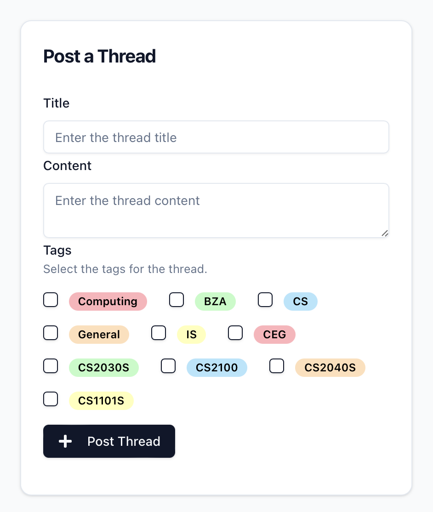
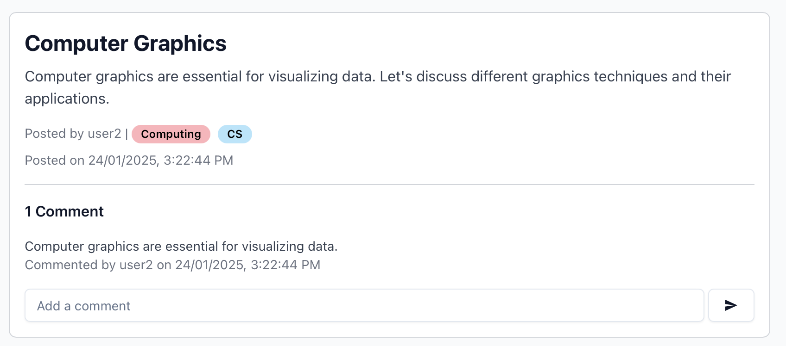
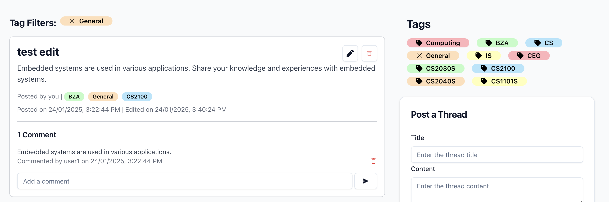
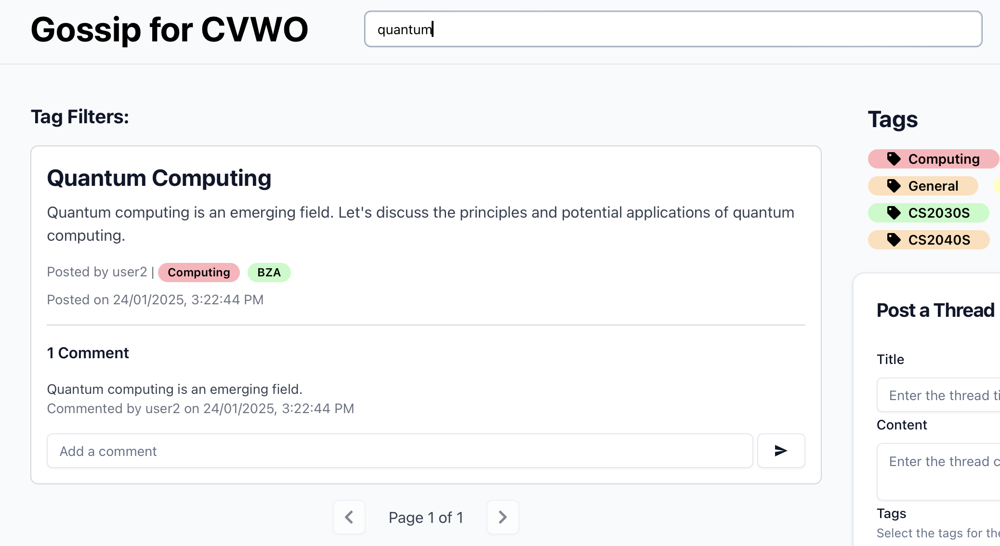
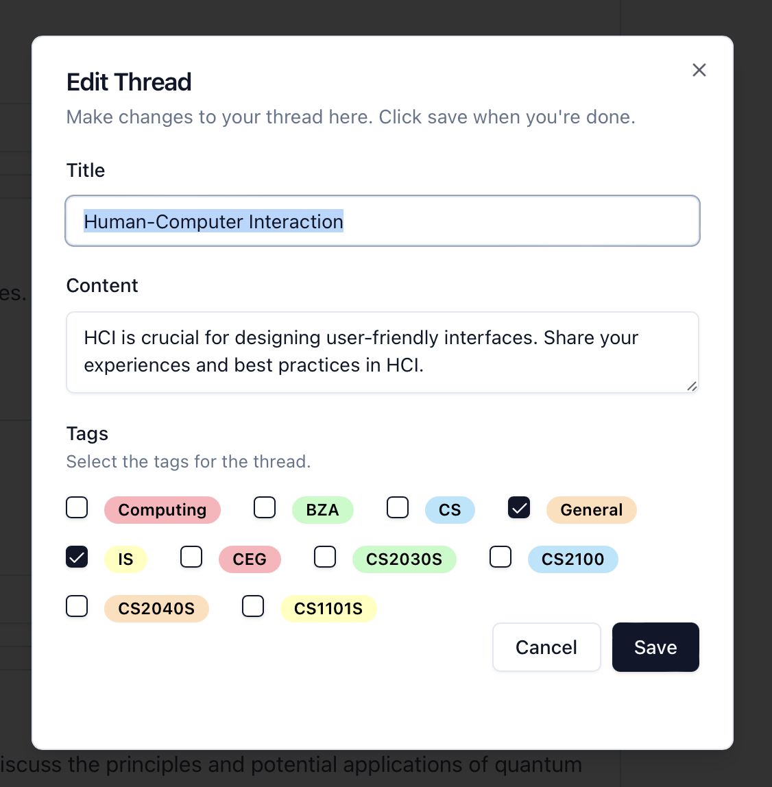
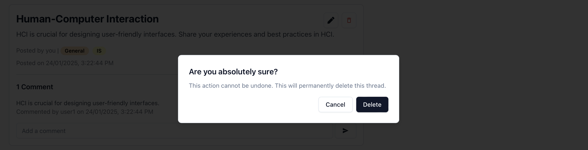

# Gossip for CVWO

This is a forum application built with React and TypeScript for the frontend, and Go with GORM for the backend. It allows users to register, log in, and participate in discussions by creating threads and posting comments. The application also supports tag-based filtering and pagination for threads.

## Features

- User authentication (login and registration)
- Create, read, update, and delete threads
- Post and delete comments
- Tag-based filtering of threads
- Pagination for threads
- Responsive design with [Tailwind CSS](https://tailwindcss.com)

## Technologies Used

### Frontend

- React
- TypeScript
- Tailwind CSS
- React Router
- Axios
- [shadcn/ui](https://ui.shadcn.com)

### Backend

- Go
- [GORM (Go ORM)](https://gorm.io/index.html)

## Getting Started

### Prerequisites

- Node.js and npm installed on your machine
- Go installed on your machine

### Installation

1. Clone the repository:

   ```sh
   git clone https://github.com/limjunan/cvwo-bryan.git
   cd cvwo-bryan
   ```

2. Install the frontend and backend dependencies:

   ```sh
   go mod tidy
   cd frontend
   npm install
   ```

### Running the Application

1. Start the backend server and seed the database:

   ```sh
   go run backend/cmd/main.go -seed
   ```

2. Start the frontend development server:

   ```sh
   cd frontend
   npm start
   ```

3. Open your browser and navigate to http://localhost:3000.

### API Endpoints

#### User Routes

- `POST /register` - Register a new user
- `POST /login` - Login a user

#### Thread Routes

- `GET /threads` - Get all threads
- `GET /threads/{id}` - Get a specific thread by ID
- `POST /threads` - Create a new thread
- `PUT /threads/{id}` - Update a thread by ID
- `DELETE /threads/{id}` - Delete a thread by ID

#### Comment Routes

- `GET /threads/{id}/comments` - Get all comments for a specific thread
- `GET /threads/{id}/comments/{commentId}` - Get a specific comment by ID
- `POST /threads/{id}/comments` - Create a new comment for a specific thread
- `PUT /threads/{id}/comments/{commentId}` - Update a comment by ID
- `DELETE /threads/{id}/comments/{commentId}` - Delete a comment by ID

#### Tag Routes

- `GET /tags` - Get all tags
- `GET /tags/{id}` - Get a specific tag by ID
- `POST /tags` - Create a new tag
- `PUT /tags/{id}` - Update a tag by ID
- `DELETE /tags/{id}` - Delete a tag by ID

### Authentication

The application uses token-based authentication, based on Username only. The token is stored in localStorage and is used to authenticate API requests.

### Routing

The application uses react-router-dom for client-side routing. The main routes are:

/login - Login page
/register - Registration page
/forum - Main forum page

### Pagination

Pagination is implemented in the Pagination component. The ThreadPage component handles the display of threads and pagination controls.

### Tag Filtering and Search

Tag filtering and Search is implemented in the Forum component. Users can filter threads by selecting tags from the sidebar, and search by using the searchbar in the header.

## Usage Guide

### Registering a New Account

Navigate to the registration page by clicking on the "Register" link.
Fill in the required fields (username) and submit the form.
You will be redirected to the forum page upon successful registration.


### Logging In

Navigate to the login page by clicking on the "Login" link.
Enter your username, then submit the form.
Upon successful login, you will be redirected to the forum page.


### Creating a New Thread

On the forum page, fill in the thread title, content, and select relevant tags on the sidebar.
Submit the form to create the new thread.



### Posting a Comment

Enter your comment in the input field at the bottom of a thread and submit the form.



### Filtering Threads by Tags

On the forum page, select tags from the sidebar to filter threads.
The threads list will update to show only threads with the selected tags.



### Searching Threads

Use the search bar in the header to search for threads by title or content.
The threads list will update to show only threads that match the search query.



### Deleting/Editing Threads and Comments

There will be delete/edit icons on thread/comments that have been posted by you.
Click on these icons.




